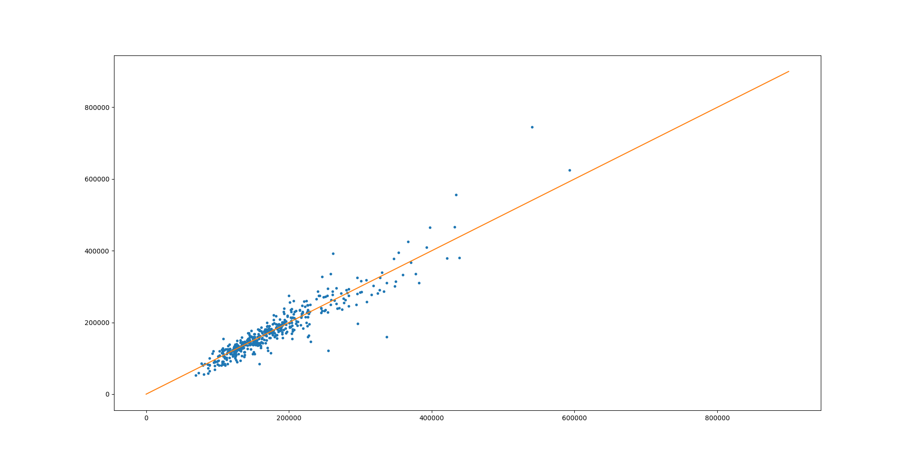
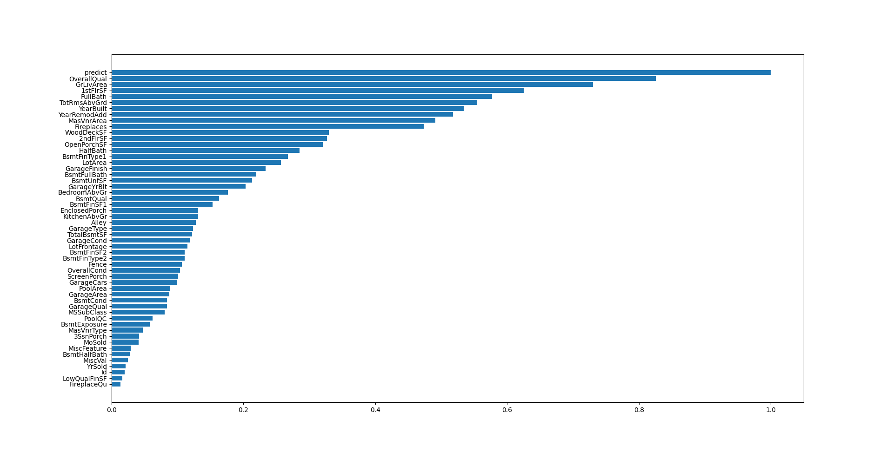

# AMA563 Principal of Data Science Report

ZHAO Baihan 21046974g

## Impute MasVnrArea using the method shown

To choose the suitable features for the linear regression of "MasVnrArea ", I draw a correlation pictures of several number features.

​												$	\rho_{\mathrm{x,y}} = corr(X, Y) =\frac{cov(X,Y)}{\sigma _X \sigma_Y} = \frac{E[(x-\mu_x)(y-\mu_y)]}{\sigma _X \sigma_Y} $ 

​		The more its absolute value close to 1, the higher relevance they have. The clear bigger picture will also be put in the attachment. According to the picture, we can find feature with high relevance are 'OverallQual', 'YearBuilt', '1stFlrSF', 'GrLivArea', 'TotRmsAbvGrd', 'Fireplaces', 'Bullbat'], and their correlations are between 0.25 and 0.39. 

​		Build the linger regression model to for the linear regression  $Y = A^Tx + b$, and then we can impute the feature 'MasVnrArea '.  

| OverallQual | YearBuilt | 1stFlrSF | GrLivArea | TotRmsAbvGrd | Fireplaces | FullBath | MasVnrArea |
| ----------: | --------- | -------- | --------- | ------------ | ---------- | -------- | ---------- |
|           6 | 2002      | 860      | 1960      | 8            | 2          | 2        | 211.1059   |
|           6 | 1957      | 2515     | 2515      | 9            | 2          | 3        | 350.9983   |
|           7 | 2007      | 822      | 1665      | 7            | 0          | 2        | 225.9624   |
|           7 | 2003      | 1200     | 1200      | 5            | 0          | 2        | 175.3446   |
|           7 | 2007      | 1428     | 1428      | 6            | 0          | 2        | 186.6322   |
|           7 | 2006      | 1241     | 1241      | 4            | 0          | 1        | 236.4274   |
|          10 | 2006      | 2076     | 2076      | 7            | 1          | 2        | 431.2742   |
|           8 | 2002      | 1128     | 2031      | 7            | 1          | 2        | 354.7571   |
|             |           |          |           |              |            |          |            |

## Impute GarageQual and apply greedy target encoding with reasonable hyper parameters.

​		Using greedy target encoding, we can transform some feature to the form of number values. And better than one hot encoding, it can avoid dimension increasing too much. We can use the formula following to replace each category tags by number.

​																	$\hat{x}_k = \frac{\sum^n_{j=1}\mathbb{I}_{\{ x_j = x_k \}}y_j + ap}{\sum^n_{j=1}\mathbb{I}_{\{ x_j = x_k \}} + a}$

where $ a>0$is a parameter. And a common setting for $p$ is the average target value in data set.  Then, we can replace each category tag by numbers.

| Category Tags | Greedy Target  Encoding |
| ------------- | ----------------------- |
| Ex            | 184.1729                |
| Fa            | 23.76621                |
| Gd            | 45.20294                |
| Po            | 441.0091                |
| TA            | 441.0091                |
| NA            | 17.28172                |

## Perform principle component analysis and create more than two new features.

### PCA algorithm steps

input: n-dimension  dataset $D = (x^1, x^2,......,x^n)$, new dimension needed to be output $n'$

output:  $n'$-dimension dataset.

1. Centralization of all samples $ x^i_j = x^i_j - \frac{1}{m} \sum_{k=1}^m 	x^i_k$;
2. Calculate the sample covariance matrix $XX^T$;
3. Eigenvalue decomposition of the covariance matrix $XX^T$;
4. Select the eigenvectors corresponding to the largest $ n'$ eigenvalues $(w_1,w_2,... ,w_{n^′}),$ and normalize all the eigenvectors to form the eigenvector matrix $W$.
5. For each sample $x^i$n the sample set, transform it into a new sample $z^i = W^Tx^i$
6. Obtain the output sample set$D' = (z^1, z^2,......z^{n'})$

By this way, we can create 3 new features, and they are stored in the 'new_feature.csv', and each feature contributes 0.2742, 0.2507,0.1527 weights respectively

## Work at least 20 features that leads to a final model using any decision tree boosting method.

Choose all numerical features and fit them in the decision tree boosting method. Using first 1000 data as train data and last 460 data as test. It's clear to see that the regression is acceptable. And to describe the accuracy of the regression, lets define the $R^2 = (1 - \frac{u}{v})$, where $u = \sum^n_{i=1}(y_i - \bar{y_i})^2$in which $\bar{y_i}$ , is the ith predict value, and $v = \sum^n_{i=1}(y_i - \mu_y)^2$.The best possible score is 1.0 and it can be negative (because the model can be arbitrarily worse). A constant model that always predicts the expected value of $y$, disregarding the input features, would get a $R^2 $score of 0.0. In this case, we get a $R^2$ as 0.87522.

## Show the variance importance and describe the first five important variables and why they are so important.

We use the correlation to mark the importance of each value. Then the top 5 important variables are OverallQual, GrLivArea, 1stFlrSF, FullBath and TotRmAbvGrd

| Variable    | Means                                                | Corr  |
| ----------- | ---------------------------------------------------- | ----- |
| OverallQual | Rates the overall material and finish of the house   | 0.826 |
| GrLivArea   | Above grade (ground) living area square feet         | 0.730 |
| 1stFlrSF    | First Floor square feet                              | 0.625 |
| FullBath    | Full bathrooms above grade                           | 0.577 |
| TotRmAbvGrd | Total rooms above grade (does not include bathrooms) | 0.554 |

OverallQual represents the quality of the house, and the following 4 variables represent the size of different part of the house. The higher OverallQual is, the higher price of unit price per square meter will be. And the bigger size is,  the higher total price will be. So, them five will be the most 5 important variable.

## List each of the feature and describes how it encoded

 BsmtUnfSF, TotalBsmtSF, GarageCars, BsmtFinSF2, BsmtFinSF1, GarageArea,MasVnrArea,LotFrontage were transformed to greedy target encoding, and there NA values are encoding as a new category.

For PoolQC, MiscFeature, Alley, Fence, FireplaceQu, GarageCond, GarageFinish,GarageYrBlt, GarageType, BsmtExposure, BsmtCond, BsmtQual, BsmtFinType2, BsmtFinType1,MasVnrType, I replace there NA values to 0.Beacuse in such variables, NA means do not have such thing. And then, I fit them directly.

Same to above, MSSubClass, LotFrontage, LotArea, OverallQual, OverallCond, YearBuilt, YearRemodAdd, MasVnrArea, 1stFlrSF, 2ndFlrSF, LowQualFinSF, GrLivArea,BsmtFullBath, BsmtHalfBath, FullBath, HalfBath, BedroomAbvGr, KitchenAbvGr, TotRmsAbvGrd, Fireplaces, GarageQual, WoodDeckSF, penPorchSF, EnclosedPorch, 3SsnPorch, ScreenPorch, PoolArea, MiscVal, MoSold, YrSold, do not have empty values. so I use them directly.

## make a Kaggle submission and report your score.

